<!-- ====================== ANIMATED BANNER ====================== -->
<div align="center">




<br/>


&nbsp;
<a href="https://github.com/edinaz?tab=followers">
  
</a>

</div>

<br/>

<!-- ====================== ABOUT (left-aligned, fixed) ====================== -->
## 👋 About Me

```ts
const edinaz = {
  age: 20,
  role: "C++ Developer",
  experience: "several years deep in C++",
  focus: ["Low-Level", "Systems", "Web Development"],
  founder: "ezn.sys",
  currentlyLearning: ["Hypervisor internals", "PCIe / DMA", "Kernel dev"],
  philosophy: "performance, precision, no abstractions in the way",
};
```

I'm a 20-year-old developer who lives close to the metal. I've spent the last few
years writing C++ and low-level systems code, and I run my own studio building and
hosting websites for real businesses.

<br/>

<!-- ====================== EZN.SYS ====================== -->
## 🌐 ezn.sys — Web Design & Hosting

<table>
<tr>
<td>

**I founded ezn.sys to get local businesses online — properly.**

Modern, fast, hand-built websites designed, developed, and hosted end-to-end.
From the first mockup to live deployment and ongoing hosting, everything runs
under one roof. No bloated templates, no page-builders — clean code that loads
fast and looks sharp on every screen.

- 🎨 Custom design tailored to each business
- ⚡ Fast, lightweight, SEO-friendly builds
- 🖥️ Reliable hosting & maintenance
- 🤝 Direct support for local owners

</td>
</tr>
</table>

<div align="center">

<a href="https://ezn.sys">
  
</a>

</div>

<br/>

<!-- ====================== ARSENAL ====================== -->
## ⚙️ Arsenal

<div align="center">

**Web & Hosting**


<br/>

**Systems & Low-Level**


<br/><br/>


</div>

<br/>

<!-- ====================== WHAT I BUILD ====================== -->
## 🛠️ What I Build

| Project | Description |
|:---|:---|
| **ezn.sys** | Web design & hosting studio for local businesses — founder & lead developer |
| **DMA Firmware** | Hardware-level firmware engineering |
| **Hypervisor (HV)** | Low-level virtualization & systems work |
| **Native Tooling** | High-performance C++ applications |
| **Vision Engine** | Real-time color / pixel detection |

<br/>

<!-- ====================== TROPHIES ====================== -->
<div align="center">


</div>

<br/>

<!-- ====================== STATS ====================== -->
## 📊 Stats

<div align="center">


<br/>


</div>

<br/>

<!-- ====================== ACTIVITY GRAPH ====================== -->
## 📈 Contribution Graph

<div align="center">


</div>

<br/>

<!-- ====================== SNAKE ====================== -->
<div align="center">


</div>

<br/>

<!-- ====================== QUOTE ====================== -->
<div align="center">


</div>

<br/>

<!-- ====================== FOOTER ====================== -->
<div align="center">


</div>
