<!-- ============ FULL-BLEED ANIMATED PROFILE (single SVG, real background) ============ -->

 

<!-- clickable links (SVG-internal links don't work on GitHub, so these live here) -->

&nbsp;

&nbsp;

 

&nbsp;

 

<!-- ============ LIVE STATS (must be external images) ============ -->

 

  

 

<!-- ============ FOOTER ============ -->

